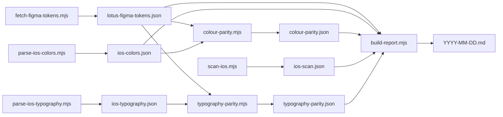

# Lotus iOS Audit

## Purpose

Generate an iOS Lotus design system audit report. The report answers two
questions:

1. **Token parity** — does the iOS Lotus implementation (`parkhub/ios/Lotus/`)
   match the canonical Figma source of truth (the Lotus design system file)?
2. **Adoption** — how much of the iOS app actually uses Lotus tokens vs
   hardcoded literals or legacy colour systems? Broken down per flow and
   per screen.

Output is a dated Markdown file. Every run produces a new file — never
overwrite previous audits. See **Output destinations** below for path resolution.

## Output destinations

The skill resolves three independent destinations, in this priority:

1. **Primary path** (always written):
   - If the user passes `--out <path>` → that exact path.
   - Else: `<lotus-repo-root>/audits/ios/YYYY-MM-DD.md`. The Lotus repo root
     is the directory three levels up from this `SKILL.md` file. The
     `audits/` directory is gitignored — generated reports don't pollute
     git history. To preserve a milestone audit in history, the user can
     `git add -f audits/ios/<file>.md` deliberately.

2. **Mirror copy** (optional, written *in addition* to primary):
   - If the env var `LOTUS_AUDIT_MIRROR` is set and points at an existing
     directory, write a second copy to `${LOTUS_AUDIT_MIRROR%/}/YYYY-MM-DD.md`.
   - This is the path users set in their shell rc to also pipe audits into a
     personal knowledge system — Obsidian, Notion via webhook, Slack via
     drop folder, etc. Empty / unset = no mirror.

3. **Index update** (optional, only if mirror is in an Obsidian vault):
   - If `LOTUS_AUDIT_MIRROR` resolves under
     `~/Documents/Olly's Brain/Areas/JustPark/Projects/Lotus/Audits/`, also
     append a wikilink to that vault's `_Index.md`. This is Olly-specific
     vault wiring and stays opt-in via the env var.

If the same date already has an audit at the primary path, suffix with `-2`,
`-3`, etc. before writing.

## Source of truth

Figma is the only source of truth for token values. The Lotus monorepo's
`DESIGN.md` is **not** authoritative for this audit (it's a future cross-platform
abstraction). The audit pulls live token data from Figma every run.

Figma file: <https://www.figma.com/design/YkS9s6Cz3EYdbr5UThzUKP/Lotus---Design-System>

## Prerequisites

Verify all four BEFORE starting any phase. If any fails, surface the problem
and stop — do not attempt workarounds.

1. **Figma Desktop running.** Check via `cd ~/figma-cli && node src/index.js status`.
   Expected output: `Connected to Figma`. If not connected, ask the user to
   open Figma Desktop.

2. **Lotus design system file is the FOCUSED tab in Figma.** This is critical —
   `figma-ds-cli` operates on whatever file is currently focused. **Stop and ask
   the user to confirm:**

   > "Have you opened the Lotus design system file and made it the focused tab
   > in Figma Desktop? Reply 'yes' to continue, or 'no' if you need a moment."

   Wait for explicit `yes`. Do not assume.

3. **figma-cli installed at `~/figma-cli/`.** Check
   `[ -f "$HOME/figma-cli/src/index.js" ]`. If missing, abort with instructions
   to install.

4. **`parkhub/ios` cloned locally.** Default expected path: `$HOME/code/ios`.
   If absent, ask the user for the path or offer to clone:
   `gh repo clone parkhub/ios $HOME/code/ios`. Store the resolved path in a
   shell variable `IOS_REPO` for the rest of the run.

## Pipeline

The audit is a four-stage data pipeline followed by report assembly.
Each stage is a self-contained script in `scripts/` — Claude's job is to
run them in order and surface progress to the user. Scripts handle the
fiddly bits (P3→sRGB conversion, alias resolution, name normalisation,
ripgrep patterns, mermaid generation, output-path resolution).



Set `SKILL_DIR=$(cd "$(dirname "$BASH_SOURCE")/.."; pwd)` mentally — it's
the directory of this SKILL.md. All script paths below are relative to it.

## Phase 1 — Fetch canonical Figma tokens

```bash
node "$SKILL_DIR/scripts/fetch-figma-tokens.mjs" /tmp/lotus-figma-tokens.json
```

Uses figma-cli to evaluate JS in Figma Desktop's plugin context, walks
`VARIABLE_ALIAS` references, and writes a flat JSON of all collections /
modes / variables with values resolved to hex.

Lotus has 5 collections (Colour Primitives, Colour, Padding, Corner Radius,
Typography) and ~160 variables. The semantic `Colour` collection has both
Light Mode and Dark Mode; the others are single-mode.

The `Typography` collection is **atomic**: separate variables for
`font-size/*`, `line-height/*`, `font-family/*`, `font-style/*` (weight)
rather than composed text styles. Phase 3.5 (typography-parity) decomposes
iOS composed styles to compare against these atoms.

If the script exits non-zero:
1. Re-prompt the user to confirm the Lotus tab is focused in Figma Desktop.
2. Retry once.
3. If retry fails, abort and surface the error.

## Phase 2 — Parse iOS asset catalog into hex (with P3→sRGB conversion)

```bash
node "$SKILL_DIR/scripts/parse-ios-colors.mjs" \
  "$IOS_REPO/Lotus/Sources/Lotus/Assets.xcassets/Lotus-Colour-Pallet" \
  > /tmp/ios-colors.json
```

Walks every `*.colorset/Contents.json` in the catalog. For each colorset,
extracts Light + Dark appearance values, parses both float (`0.234`) and
hex-byte (`0x37`) component formats, and applies a P3→sRGB matrix transform
(D65 white point) when `color-space: display-p3`. Output includes both the
**displayed sRGB hex** (what users actually see on a P3-capable iPhone) and
the **raw hex bytes** stored in the file — the displayed value is the right
thing to compare against Figma; the raw value is for transparency.

iOS Swift token sources at `$IOS_REPO/Lotus/Sources/Lotus/`:
`LotusColours.swift` · `LotusTypography.swift` · `LotusSpacing.swift` · `LotusCorners.swift`.
Colour values come from the asset catalog (parsed above). Spacing and
radius values are read directly from the Swift constants by
`build-report.mjs`. Typography is parsed in the next sub-step.

### Phase 2.5 — Parse iOS typography

```bash
node "$SKILL_DIR/scripts/parse-ios-typography.mjs" \
  "$IOS_REPO/Lotus/Sources/Lotus/LotusTypography.swift" \
  > /tmp/ios-typography.json
```

Extracts `(name, family, weight, size)` tuples from the `Font.custom(...)`,
`UIFont(name:size:)`, and `Font.system(size:weight:)` calls in the Swift
file. Decomposes PostScript names like `NunitoSans-Bold` into family
("Nunito Sans") + weight ("Bold").

## Phase 3 — Diff Figma vs iOS (token parity)

```bash
node "$SKILL_DIR/scripts/colour-parity.mjs" \
  /tmp/lotus-figma-tokens.json \
  /tmp/ios-colors.json \
  > /tmp/colour-parity.json
```

Normalises Figma's kebab-case names (`Primary-Default`) and iOS's camelCase
asset names (`PrimaryDefault`) for comparison. Applies known structural
remaps (e.g. `Brand/Primary → Brand.JustparkGreen`,
`Surface/Primary → Surface.White`). Categorises every Figma semantic colour
as `match` / `dark-only-mismatch` / `mismatch` / `missing-ios`, and lists
`iosOnlyTokens` separately.

Padding and Corner Radius parity is computed by `build-report.mjs` directly
from the Figma JSON + the embedded iOS spacing/radius constants — no
separate script.

### Phase 3.5 — Diff Figma typography vs iOS typography

```bash
node "$SKILL_DIR/scripts/typography-parity.mjs" \
  /tmp/lotus-figma-tokens.json \
  /tmp/ios-typography.json \
  > /tmp/typography-parity.json
```

Decomposes each iOS composed style into `(family, size, weight)` atoms and
checks each atom against Figma's `font-size/*`, `font-family/*`, and
`font-style/*` sets. Reports per-iOS-style status plus the inverse
direction (Figma sizes/families/weights iOS doesn't use).

## Phase 4 — Scan iOS app for adoption

```bash
node "$SKILL_DIR/scripts/scan-ios.mjs" \
  "$IOS_REPO" \
  "$SKILL_DIR/flows.yaml" \
  > /tmp/ios-scan.json
```

Walks `JustPark/Screens`, `JustPark/Shared`, `Shared`, `Frameworks`,
`Widget`, `NotificationsContent`, `NotificationsService`, `JPIntents`
(excluding `Lotus/`, `*Tests/`, `Ampli/`, `Screens/Debug/Lotus/`).

For each Swift file, counts:

- **Compliant:** `LotusColours.*`, `LotusTypography.*`, `LotusSpacing.spacing*`,
  `LotusCorners.radius*`.
- **Legacy:** `.jp*` (the 2017 palette), `UIColor.Semantic.*` /
  `UIColor.Primitive.*` (Design 2.0 intermediate).
- **Hardcoded literals:** `UIColor(red:...)`, `Color(.system…)`,
  `.foregroundColor(.white)`, `Font.system(size:)`, `.padding(<n>)`,
  `.cornerRadius(<n>)`, etc. The full pattern set is in `scan-ios.mjs`'s
  `PATTERNS` constant.

Output JSON aggregates by file, by screen folder, by flow (per
`flows.yaml`), and totals. Includes `worstFiles` (top 25 by violation count)
and `topAffected` per pattern.

## Phase 5 — Compile and write report

```bash
node "$SKILL_DIR/scripts/build-report.mjs"
# Or override the primary destination:
node "$SKILL_DIR/scripts/build-report.mjs" --out "/some/path/audit.md"
```

Reads the four JSON outputs from earlier phases (paths configurable via
`FIGMA_JSON`, `IOS_COLORS`, `PARITY_JSON`, `SCAN_JSON` env vars; defaults
to `/tmp/`). Writes the assembled Markdown to:

1. **Primary:** `<lotus-repo>/audits/ios/YYYY-MM-DD.md` — the script
   resolves the repo root from its own location. Override via `--out`.
2. **Mirror:** `$LOTUS_AUDIT_MIRROR/YYYY-MM-DD.md` if the env var is set
   and the directory exists.
3. **Vault index:** appends `- [[Audits/<filename>]]` under the `## Audits`
   heading of `_Index.md`, but only when the mirror is the Olly-vault path.

Collision handling (same-day reruns) appends `-2`, `-3`, etc. to the
filename — primary and mirror use independent counters.

## Report structure

The output sections, mermaid diagrams, and prose are all assembled by
`scripts/build-report.mjs`. The current shape:

1. Header (date, iOS commit, Figma snapshot timestamp, P3→sRGB caveat)
2. `## Summary` — one paragraph callout
3. `## Token parity (Figma ↔ iOS)` — Colours (mismatch / dark-only-mismatch /
   missing-in-iOS / iOS-only sub-tables) · Padding · Corner radius · Typography
4. `## Adoption — repo total` — counts + pie chart
5. `## Adoption by flow` — table + xy-bar chart
6. `## Adoption by screen` — table sorted by violation count
7. `## Top violations` — pattern counts + worst-offender files
8. `## Legacy colour systems` — `.jp*` and Design 2.0 hot spots
9. `## Notable findings` — Critical / Structural / Type system
10. `## Recommendations` — primary recommendation is the iOS P3→sRGB
    migration, followed by other lower-priority items
11. `## Methodology + caveats`

To change the report shape, edit `build-report.mjs`. The SKILL.md doesn't
need to know — it just runs the pipeline.

## Important rules

- **Always prompt for Lotus-tab-focused confirmation** in Phase 1 prereqs.
  Don't assume.
- **Each run produces a new dated file.** Never overwrite previous audits.
  Never modify any pre-existing manually-authored audit (e.g. a vault note
  titled "Lotus — iOS Audit.md"); the skill writes only to its own dated
  `audits/ios/YYYY-MM-DD.md` filenames.
- **Default output is repo-relative and gitignored.** Don't write to a vault
  path unless the user has explicitly opted in via `--out` or
  `LOTUS_AUDIT_MIRROR`. The skill is a team tool — its default behaviour
  must work for anyone who clones the repo.
- **Read-only on `parkhub/ios` and the Lotus Figma file.** This skill never
  writes to either.
- **No PAT, no API.** Token data comes via figma-cli's local CDP connection,
  never via Figma's REST API.
- **Don't run figma-cli's `connect` command** — it brings Figma to focus and
  can disrupt the user's full-screen workspace. The user is responsible for
  focusing the Lotus tab; the skill operates on whatever's focused.
- **Spell out acronyms on first use** in the report (e.g. "Search Results
  Page (SRP)").
- **Use Obsidian wikilinks** (`[[Note Name]]`) only when the report is being
  written to a vault destination. For repo-local primary output, prefer
  plain Markdown links — Obsidian-only syntax renders awkwardly elsewhere.

## Future enhancements

Not implemented yet — file as separate PRs:

- **Trend / drift comparison** between the latest audit and the previous one
  (per-flow ratio deltas, new and resolved violation files). The audits
  directory is the natural input.
- **Component-level parity** — detect e.g. `Button(...)` where `ButtonPrimary`
  should be used. v1 is token-only.
- **Line-height parity** — Figma defines `line-height/*` atoms but iOS
  `LotusTypography.swift` doesn't expose line height per style (relies on
  default spacing). Comparison requires changes on the iOS side first.
- **Composed text-style parity** — Figma may add composed `text/*` tokens
  that bundle family + size + weight + line-height. The audit currently
  compares atoms only.
