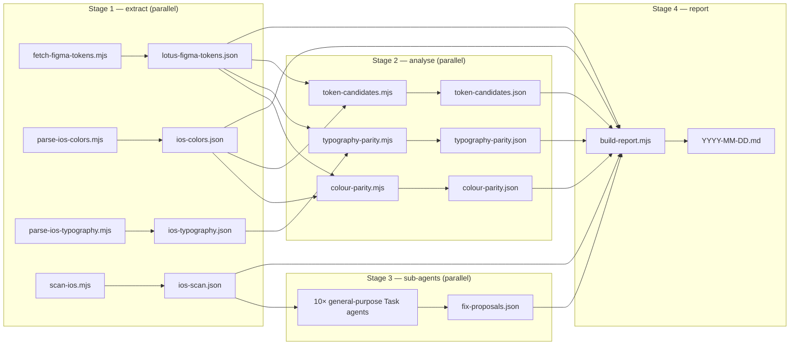

# Lotus iOS Audit

## Purpose

Generate an iOS Lotus design system audit report. The report answers two
questions:

1. **Token parity** — does the iOS Lotus implementation (`parkhub/ios/Lotus/`)
   match the canonical Figma source of truth (the Lotus design system file)?
2. **Adoption** — how much of the iOS app actually uses Lotus tokens vs
   hardcoded literals or legacy colour systems? Broken down per flow and
   per screen.

Output is a dated Markdown file. Every run produces a new file — never
overwrite previous audits. See **Output destinations** below for path resolution.

## Output destinations

The skill resolves three independent destinations, in this priority:

1. **Primary path** (always written):
   - If the user passes `--out <path>` → that exact path.
   - Else: `<lotus-repo-root>/audits/ios/YYYY-MM-DD.md`. The Lotus repo root
     is the directory three levels up from this `SKILL.md` file. The
     `audits/` directory is gitignored — generated reports don't pollute
     git history. To preserve a milestone audit in history, the user can
     `git add -f audits/ios/<file>.md` deliberately.

2. **Mirror copy** (optional, written *in addition* to primary):
   - If the env var `LOTUS_AUDIT_MIRROR` is set and points at an existing
     directory, write a second copy to `${LOTUS_AUDIT_MIRROR%/}/YYYY-MM-DD.md`.
   - This is the path users set in their shell rc to also pipe audits into a
     personal knowledge system — Obsidian, Notion via webhook, Slack via
     drop folder, etc. Empty / unset = no mirror.

3. **Index update** (optional, only if mirror is in an Obsidian vault):
   - If `LOTUS_AUDIT_MIRROR` resolves under
     `~/Documents/Olly's Brain/Areas/JustPark/Projects/Lotus/Audits/`, also
     append a wikilink to that vault's `_Index.md`. This is Olly-specific
     vault wiring and stays opt-in via the env var.

If the same date already has an audit at the primary path, suffix with `-2`,
`-3`, etc. before writing.

## Source of truth

Figma is the only source of truth for token values. The Lotus monorepo's
`DESIGN.md` is **not** authoritative for this audit (it's a future cross-platform
abstraction). The audit pulls live token data from Figma every run.

Figma file: <https://www.figma.com/design/YkS9s6Cz3EYdbr5UThzUKP/Lotus---Design-System>

## Prerequisites

Verify all four BEFORE starting any phase. If any fails, surface the problem
and stop — do not attempt workarounds.

1. **Figma Desktop running.** Check via `cd ~/figma-cli && node src/index.js status`.
   Expected output: `Connected to Figma`. If not connected, ask the user to
   open Figma Desktop.

2. **Lotus design system file is the FOCUSED tab in Figma.** This is critical —
   `figma-ds-cli` operates on whatever file is currently focused. **Stop and ask
   the user to confirm:**

   > "Have you opened the Lotus design system file and made it the focused tab
   > in Figma Desktop? Reply 'yes' to continue, or 'no' if you need a moment."

   Wait for explicit `yes`. Do not assume.

3. **figma-cli installed at `~/figma-cli/`.** Check
   `[ -f "$HOME/figma-cli/src/index.js" ]`. If missing, abort with instructions
   to install.

4. **`parkhub/ios` cloned locally.** Default expected path: `$HOME/code/ios`.
   If absent, ask the user for the path or offer to clone:
   `gh repo clone parkhub/ios $HOME/code/ios`. Store the resolved path in a
   shell variable `IOS_REPO` for the rest of the run.

## Pipeline

The audit runs in four stages. Stages 1 and 2 are pure data extraction and
the four stage-1 scripts have **no dependencies on each other** — the
orchestrator should invoke them in parallel (one message containing four
Bash tool calls). Stage 2 analyses the data, also parallelisable.
Stage 3 is sub-agent–driven (per-file fix proposals). Stage 4 assembles
the final report.



Set `SKILL_DIR=$(cd "$(dirname "$BASH_SOURCE")/.."; pwd)` mentally — it's
the directory of this SKILL.md. All script paths below are relative to it.

## Stage 1 — Extract data (run all four in parallel)

These four scripts have **no dependencies on each other**. Invoke them in
a single message with four parallel `Bash` tool calls. Total wall-clock
time is gated by the slowest (`scan-ios` or `fetch-figma-tokens`).

```bash
# Send these as four parallel Bash tool calls in one message:

node "$SKILL_DIR/scripts/fetch-figma-tokens.mjs" /tmp/lotus-figma-tokens.json
node "$SKILL_DIR/scripts/parse-ios-colors.mjs" \
  "$IOS_REPO/Lotus/Sources/Lotus/Assets.xcassets/Lotus-Colour-Pallet" \
  > /tmp/ios-colors.json
node "$SKILL_DIR/scripts/parse-ios-typography.mjs" \
  "$IOS_REPO/Lotus/Sources/Lotus/LotusTypography.swift" \
  > /tmp/ios-typography.json
node "$SKILL_DIR/scripts/scan-ios.mjs" "$IOS_REPO" "$SKILL_DIR/flows.yaml" \
  > /tmp/ios-scan.json
```

What each does:

- **`fetch-figma-tokens.mjs`** — drives figma-cli against the running Figma
  Desktop, walks `VARIABLE_ALIAS` references, writes resolved hex per mode.
  Lotus currently has 5 collections (Colour Primitives, Colour, Padding,
  Corner Radius, Typography) and ~160 variables.
- **`parse-ios-colors.mjs`** — walks every `*.colorset/Contents.json`,
  parses both float and `0xRR` component formats, applies a P3→sRGB matrix
  transform (D65) when `color-space: display-p3` so the hex matches what
  users see on a P3-capable iPhone. Outputs both displayed and raw hex.
- **`parse-ios-typography.mjs`** — extracts `(name, family, weight, size)`
  tuples from `Font.custom(...)`, `UIFont(name:size:)`, and
  `Font.system(size:weight:)` calls.
- **`scan-ios.mjs`** — counts compliant, legacy, and hardcoded references
  across `JustPark/Screens`, `JustPark/Shared`, `Shared`, `Frameworks`,
  `Widget`, `NotificationsContent`, `NotificationsService`, `JPIntents`.
  Aggregates per-file, per-screen, per-flow.

If `fetch-figma-tokens` exits non-zero:
1. Re-prompt the user to confirm the Lotus tab is focused in Figma Desktop.
2. Retry once. If retry fails, abort and surface the error.

## Stage 2 — Analyse (run all three in parallel)

```bash
# Send these as three parallel Bash tool calls in one message:

node "$SKILL_DIR/scripts/colour-parity.mjs" \
  /tmp/lotus-figma-tokens.json /tmp/ios-colors.json \
  > /tmp/colour-parity.json

node "$SKILL_DIR/scripts/typography-parity.mjs" \
  /tmp/lotus-figma-tokens.json /tmp/ios-typography.json \
  > /tmp/typography-parity.json

node "$SKILL_DIR/scripts/token-candidates.mjs" \
  "$IOS_REPO" /tmp/lotus-figma-tokens.json /tmp/ios-colors.json \
  > /tmp/token-candidates.json
```

- **`colour-parity.mjs`** — Figma↔iOS colour comparison with name
  normalisation (kebab vs camel), known structural remaps, status per
  Figma semantic colour: match / dark-only-mismatch / mismatch /
  missing-ios; plus iOS-only colours.
- **`typography-parity.mjs`** — decomposes iOS composed styles into atoms
  and checks each atom against Figma's `font-size/*`, `font-family/*`,
  `font-style/*` sets.
- **`token-candidates.mjs`** — finds hardcoded values used N+ times in iOS
  code that aren't already tokens. Classifies each as
  `use-existing-token` (adoption gap), `near-miss` (1pt off — likely
  typo), or `new-candidate` (worth proposing as a Figma token).
  Excludes colour-system definition files (`UIColor+JP.swift`,
  `UIColor+Design2.0.swift`, etc.) — those define colours, they
  shouldn't surface as candidates.

Padding and Corner Radius parity is computed by `build-report.mjs`
directly from the Figma JSON + the iOS spacing/radius constants —
no separate analyser script.

## Stage 3 — Sub-agent fix proposals (parallel)

This stage uses the `Task` tool to spawn one **general-purpose** sub-agent
per worst-offender file. Each sub-agent reads the file, considers the
available Lotus tokens, and proposes concrete migrations. Spawn all
sub-agents in **a single message with multiple Task tool calls** so they
run in parallel.

**How many?** Read `/tmp/ios-scan.json`, take `worstFiles[0..9]` (top 10
by violation count). Skip files where `violations < 5` — too small to be
worth the round-trip.

**Sub-agent prompt template** (substitute the variables in `{...}`):

> ```
> You are reviewing a single Swift file in the JustPark iOS app for migration
> away from legacy / hardcoded styling and toward the Lotus design system.
>
> File: {abs-path}
> Total violations the audit detected in this file: {violation_count}.
>
> The available Lotus token namespaces (read from
> {ios-repo}/Lotus/Sources/Lotus/) are:
> - LotusColours (asset-catalog-backed, organised by Brand/Surface/Text/Border/Action/Alerts)
> - LotusTypography (Font and UIFont type styles)
> - LotusSpacing (CGFloat constants: spacingNone..spacingXXXLarge)
> - LotusCorners (CGFloat constants: radiusNone..radiusFull)
>
> Read the file at the path above. For each violation you find — `.jp*` palette
> usage, `UIColor(red:green:blue:)` literals, `Font.system(size:)`, `.padding(<n>)`,
> `.cornerRadius(<n>)`, `UIColor.Semantic.*`, etc. — propose the concrete migration.
>
> Output STRICTLY as JSON (no other prose), structured as:
> [
>   {
>     "line": <line number>,
>     "current": "<exact snippet>",
>     "proposed": "<exact replacement snippet>",
>     "tokenUsed": "<LotusXxx.Yyy>",
>     "confidence": "high"|"medium"|"low",
>     "note": "<optional caveat — e.g. P3-vs-sRGB shift, name disambiguation>"
>   }
> ]
>
> Cap at 15 suggestions per file. If you can't determine the right token for a
> violation, omit it rather than guessing. Output ONLY the JSON array. No prose.
> ```

**Aggregation:** when sub-agents return, parse each JSON response and
collect into a single `/tmp/fix-proposals.json` of shape:

```json
{
  "generatedAt": "<ISO timestamp>",
  "proposals": [
    { "file": "<rel path>", "suggestions": [ ... ], "error": "<if sub-agent failed>" }
  ]
}
```

Use the `Write` tool to write the aggregated JSON. `build-report.mjs`
will pick it up automatically and render a "Suggested fixes" section.

If the orchestrator can't spawn Task agents (skill running without Task
permission), skip Stage 3 — `build-report.mjs` degrades gracefully.

## Stage 4 — Compile and write report

```bash
node "$SKILL_DIR/scripts/build-report.mjs"
# Or override the primary destination:
node "$SKILL_DIR/scripts/build-report.mjs" --out "/some/path/audit.md"
```

Reads all earlier outputs (paths configurable via env vars: `FIGMA_JSON`,
`IOS_COLORS`, `PARITY_JSON`, `SCAN_JSON`, `TYPO_PARITY_JSON`,
`CANDIDATES_JSON`, `FIX_PROPOSALS_JSON`; defaults to `/tmp/`). Optional
inputs (typography parity, candidates, fix proposals) degrade gracefully
if missing.

Writes the assembled Markdown to:

1. **Primary:** `<lotus-repo>/audits/ios/YYYY-MM-DD.md` — the script
   resolves the repo root from its own location. Override via `--out`.
2. **Mirror:** `$LOTUS_AUDIT_MIRROR/YYYY-MM-DD.md` if the env var is set
   and the directory exists.
3. **Vault index:** appends `- [[Audits/<filename>]]` under the `## Audits`
   heading of `_Index.md`, but only when the mirror is the Olly-vault path.

Collision handling (same-day reruns) appends `-2`, `-3`, etc. to the
filename — primary and mirror use independent counters.

## Report structure

The output sections, mermaid diagrams, and prose are all assembled by
`scripts/build-report.mjs`. The current shape:

1. Header (date, iOS commit, Figma snapshot timestamp, P3→sRGB caveat)
2. `## Summary` — one paragraph callout
3. `## Token parity (Figma ↔ iOS)` — Colours (mismatch / dark-only-mismatch /
   missing-in-iOS / iOS-only sub-tables) · Padding · Corner radius · Typography
4. `## Adoption — repo total` — counts + pie chart
5. `## Adoption by flow` — table + xy-bar chart
6. `## Adoption by screen` — table sorted by violation count
7. `## Top violations` — pattern counts + worst-offender files
8. `## Legacy colour systems` — `.jp*` and Design 2.0 hot spots
9. `## Token candidates from iOS` — repeatedly-used hardcoded values
   classified as use-existing-token / near-miss / new-candidate
   (only present if `token-candidates.json` was produced)
10. `## Suggested fixes — worst-offender files` — concrete migration
    suggestions per file from Stage 3 sub-agents (only present if
    `fix-proposals.json` was produced)
11. `## Notable findings` — Critical / Structural / Type system
12. `## Recommendations` — primary recommendation is the iOS P3→sRGB
    migration, followed by other lower-priority items
13. `## Methodology + caveats`

To change the report shape, edit `build-report.mjs`. The SKILL.md doesn't
need to know — it just runs the pipeline.

## Important rules

- **Always prompt for Lotus-tab-focused confirmation** in the Prerequisites
  step. Don't assume.
- **Run Stage 1 in parallel** (single message, four `Bash` tool calls) and
  Stage 2 in parallel (three `Bash` tool calls). Stage 3 sub-agents also
  run in parallel via simultaneous `Task` tool calls.
- **Each run produces a new dated file.** Never overwrite previous audits.
  Never modify any pre-existing manually-authored audit (e.g. a vault note
  titled "Lotus — iOS Audit.md"); the skill writes only to its own dated
  `audits/ios/YYYY-MM-DD.md` filenames.
- **Default output is repo-relative and gitignored.** Don't write to a vault
  path unless the user has explicitly opted in via `--out` or
  `LOTUS_AUDIT_MIRROR`. The skill is a team tool — its default behaviour
  must work for anyone who clones the repo.
- **Read-only on `parkhub/ios` and the Lotus Figma file.** This skill never
  writes to either.
- **No PAT, no API.** Token data comes via figma-cli's local CDP connection,
  never via Figma's REST API.
- **Don't run figma-cli's `connect` command** — it brings Figma to focus and
  can disrupt the user's full-screen workspace. The user is responsible for
  focusing the Lotus tab; the skill operates on whatever's focused.
- **Spell out acronyms on first use** in the report (e.g. "Search Results
  Page (SRP)").
- **Use Obsidian wikilinks** (`[[Note Name]]`) only when the report is being
  written to a vault destination. For repo-local primary output, prefer
  plain Markdown links — Obsidian-only syntax renders awkwardly elsewhere.

## Future enhancements

Not implemented yet — file as separate PRs:

- **Trend / drift comparison** between the latest audit and the previous one
  (per-flow ratio deltas, new and resolved violation files). The audits
  directory is the natural input.
- **Component-level parity** — detect e.g. `Button(...)` where `ButtonPrimary`
  should be used. v1 is token-only.
- **Line-height parity** — Figma defines `line-height/*` atoms but iOS
  `LotusTypography.swift` doesn't expose line height per style (relies on
  default spacing). Comparison requires changes on the iOS side first.
- **Composed text-style parity** — Figma may add composed `text/*` tokens
  that bundle family + size + weight + line-height. The audit currently
  compares atoms only.
