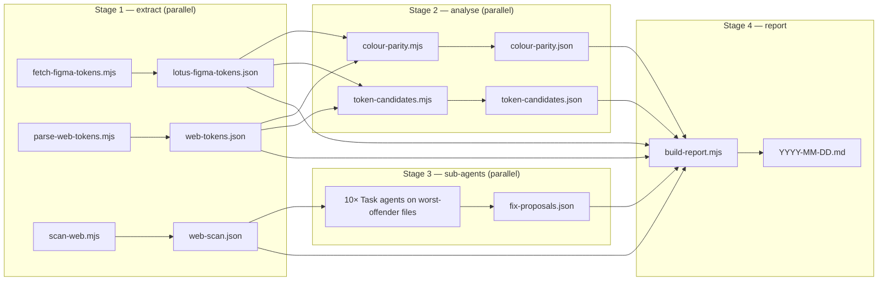

# Lotus Web Audit

## Purpose

Generate a Lotus design system audit report for JustPark's customer-facing web
surfaces. The report answers two questions:

1. **Token parity** — does the web Lotus implementation (`@justpark/ui`'s SCSS
   tokens in `parkhub/frontend/justpark-ui/src/scss/lotus/`) match the
   canonical Figma source of truth?
2. **Adoption** — how much of the customer-facing web actually uses Lotus
   tokens vs hardcoded literals or the legacy `_jpColors.scss` palette?
   Broken down per app + per file.

Output is a dated Markdown file in `<lotus-repo>/audits/web/YYYY-MM-DD.md`.
Every run produces a new file — never overwrite previous audits.

## Customer-facing scope (v1)

The web stack at JustPark spans many apps. **Only these are customer-facing**
and in scope for this audit (per [[JustPark Jargon]]):

| Path | What | Files-of-interest |
|---|---|---|
| `frontend/web` | "JustPark Web" — main consumer SSR SPA. The primary B2C product. | `.tsx`, `.jsx`, `.scss`, `.css` |
| `frontend/pay` | "Quick Pay" — standalone pay-on-the-go product (separate Amplitude project) | `.tsx`, `.scss`, `.css` |
| `justpark/resources/views/mobile` | Legacy PHP/Blade — m.justpark.com mobile web (63 templates) | `.blade.php` |
| `justpark/resources/views/site` | Legacy PHP/Blade — main site pages (13 templates) | `.blade.php` |
| `justpark/resources/views/bookings` `listings` `referrals` `auth` `npp` `static` | Legacy customer-facing Blade pages | `.blade.php` |
| `justpark/resources/assets/scss` | Legacy SCSS asset pipeline served by Gulp | `.scss` |

**Explicitly excluded** (operator / internal — different audit if ever):

- `frontend/luna` — operator portal (parking space owners/hosts)
- `frontend/solar` — internal ops/admin tool
- `frontend/terra` — business account portal (fleet/corporate)
- `frontend/enforcement` — enforcement tool
- `frontend/b2b` — B2B components
- `frontend/event-management-tool`, `frontend/browser-extension`, `frontend/qr` — internal/dev utilities
- `justpark/resources/views/admin`, `callcentre`, `dashboard`, `pdf`, `emails`, `api`, `auxiliary`, `misc`, `vendor` — admin/internal/transactional emails
- `justpark-blog` — engineering blog (separate property)

**Also customer-facing but not auditable here:**

- **Storyblok-hosted pages** — marketing landing pages + brand partner themes
  (e.g. NCP, O2). Content-managed, not in code. **Storyblok also allows runtime
  token overrides** via CSS custom properties — that's the *intended*
  per-partner theming mechanism. The audit can't read these overrides; report
  surfaces this as an out-of-scope callout.

## Source of truth

Figma is the only source of truth for token values. Single Figma file shared
with the iOS audit: <https://www.figma.com/design/YkS9s6Cz3EYdbr5UThzUKP/Lotus---Design-System>

## Prerequisites

Verify all four BEFORE starting any phase. If any fails, surface the problem
and stop — do not attempt workarounds.

1. **Figma Desktop running.** Check via
   `cd ~/figma-cli && node src/index.js status`. Expected output:
   `Connected to Figma`. If not connected, ask the user to open Figma Desktop.

2. **Lotus design system file is the FOCUSED tab in Figma.** This is critical —
   `figma-ds-cli` operates on whatever file is currently focused. **Stop and
   ask the user to confirm:**

   > "Have you opened the Lotus design system file and made it the focused tab
   > in Figma Desktop? Reply 'yes' to continue, or 'no' if you need a moment."

   Wait for explicit `yes`. Do not assume.

3. **figma-cli installed at `~/figma-cli/`.** Check
   `[ -f "$HOME/figma-cli/src/index.js" ]`. If missing, abort with instructions
   to install.

4. **`parkhub/frontend` and `parkhub/justpark` cloned locally.** Defaults:
   `$HOME/code/frontend` and `$HOME/code/justpark`. If absent, ask the user
   for paths or offer to clone:
   `gh repo clone parkhub/frontend $HOME/code/frontend -- --depth 1` and
   `gh repo clone parkhub/justpark $HOME/code/justpark -- --depth 1`. Store
   the resolved paths in `FRONTEND_REPO` and `JUSTPARK_REPO`.

## Output destinations

The skill resolves three independent destinations, in this priority:

1. **Primary path** (always written):
   - If `--out <path>` is passed → that exact path.
   - Else: `<lotus-repo-root>/audits/web/YYYY-MM-DD.md`. The Lotus repo root
     is the directory three levels up from this `SKILL.md` file. The
     `audits/` directory is gitignored — generated reports don't pollute
     git history.

2. **Mirror copy** (optional):
   - If the env var `LOTUS_AUDIT_MIRROR` is set and points at an existing
     directory, write a second copy to `${LOTUS_AUDIT_MIRROR%/}/YYYY-MM-DD-web.md`
     (suffixed `-web` to distinguish from iOS audits in the same folder).

3. **Vault-index update** (optional, only if mirror is in Olly's vault):
   - Same logic as `lotus-audit-ios`. Append a wikilink under `## Audits` in
     the vault's `_Index.md`.

If the same date already has an audit at the primary path, suffix with `-2`,
`-3`, etc. before writing.

## Pipeline

Four stages. Stages 1 and 2 are pure data extraction and parallelisable.
Stage 3 is sub-agent driven (per-file fix proposals). Stage 4 assembles the
report.



Set `SKILL_DIR=$(cd "$(dirname "$BASH_SOURCE")/.."; pwd)` mentally — it's
the directory of this SKILL.md.

## Stage 1 — Extract data (run all three in parallel)

Send as three parallel `Bash` tool calls in one message.

```bash
# Stage 1a: Figma tokens (slowest, gated on Figma Desktop)
node "$SKILL_DIR/scripts/fetch-figma-tokens.mjs" /tmp/lotus-figma-tokens.json

# Stage 1b: Web Lotus SCSS tokens
node "$SKILL_DIR/scripts/parse-web-tokens.mjs" \
  "$FRONTEND_REPO/justpark-ui/src/scss/lotus" \
  > /tmp/web-tokens.json

# Stage 1c: scan customer-facing web for compliance
node "$SKILL_DIR/scripts/scan-web.mjs" \
  "$FRONTEND_REPO" "$JUSTPARK_REPO" "$SKILL_DIR/apps.yaml" \
  > /tmp/web-scan.json
```

What each does:

- **`fetch-figma-tokens.mjs`** — identical to the iOS audit's fetch script.
  Drives figma-cli against the running Figma Desktop, walks
  `VARIABLE_ALIAS` references, writes resolved hex per mode. Lotus currently
  has 5 collections (Colour Primitives, Colour, Padding, Corner Radius,
  Typography) and ~160 variables.
- **`parse-web-tokens.mjs`** — parses `_colorPrimitives.scss`, `_colors.scss`,
  `_spacing.scss`, `_radius.scss` in `justpark-ui/src/scss/lotus/`. Returns
  a JSON map of `{ primitives, semantic, spacing, radius }` with values and
  whether each token uses the CSS-custom-property override pattern
  (`var(--lotus-..., #{$-...})`).
- **`scan-web.mjs`** — walks the customer-facing apps + Blade dirs declared
  in `apps.yaml`. Counts compliant uses (Lotus SCSS imports + `@justpark/ui`
  component imports), legacy uses (`_jpColors.scss` variables like
  `$justparkGreen`, `$jp-*`), and hardcoded literals (hex strings, raw
  `px`/`rem` values in CSS contexts, inline `style={{}}` props in JSX,
  inline `style=""` attributes in Blade). Aggregates per file, per app.

If `fetch-figma-tokens` exits non-zero:
1. Re-prompt the user to confirm the Lotus tab is focused in Figma Desktop.
2. Retry once. If retry fails, abort and surface the error.

## Stage 2 — Analyse (run both in parallel)

```bash
node "$SKILL_DIR/scripts/colour-parity.mjs" \
  /tmp/lotus-figma-tokens.json /tmp/web-tokens.json \
  > /tmp/colour-parity.json

node "$SKILL_DIR/scripts/token-candidates.mjs" \
  "$FRONTEND_REPO" "$JUSTPARK_REPO" \
  /tmp/lotus-figma-tokens.json /tmp/web-tokens.json \
  > /tmp/token-candidates.json
```

- **`colour-parity.mjs`** — compares Figma's semantic Colour collection
  against `_colors.scss` semantic tokens. Web's CSS-custom-property wrapper
  means each token has a *fallback hex value* — that's what we compare to
  the Figma hex value (sRGB on both sides, no colour-space conversion
  needed). Status per token: `match` / `mismatch` / `missing-web` / `web-only`.
- **`token-candidates.mjs`** — finds hardcoded values used N+ times in
  customer-facing code that aren't already Lotus tokens. Same logic as iOS,
  with web-flavoured patterns (`.tsx` inline styles, SCSS `color:` values,
  Blade `style=""` attributes). Excludes the SCSS-definition files
  themselves (`_colorPrimitives.scss`, `_jpColors.scss`, `_variables.scss`).

Padding and Corner Radius parity is computed by `build-report.mjs` directly
from the Figma JSON + the web SCSS spacing/radius constants — no separate
analyser script.

**Typography parity is mostly a non-event for web** today. Figma has
typography Variables (`font-size/*`, `font-family/*`, `font-style/*`) but
`justpark-ui/src/scss/lotus/` has **no typography tokens** in v1 of web
Lotus. The report flags this as a known gap.

## Stage 3 — Sub-agent fix proposals (parallel)

Same architecture as the iOS audit. Spawn one general-purpose `Task` agent
per worst-offender file (top 10, ≥5 violations). Skip files that match the
SCSS-definition exclude list — those *define* tokens, they shouldn't surface
as candidates for migration.

**Sub-agent prompt template** (substitute the variables in `{...}`):

> ```
> You are reviewing a single file in a JustPark web app for migration away
> from legacy / hardcoded styling and toward the Lotus design system.
>
> File: {abs-path}
> Total violations the audit detected in this file: {violation_count}
>
> The available Lotus SCSS tokens (importable via `@use '@justpark/ui/src/scss/lotus/<module>'`):
>
> - colors: `colors.$text-primary`, `colors.$text-secondary`, `colors.$text-disabled`,
>   `colors.$text-white`, `colors.$surface-white`, `colors.$surface-light-grey`,
>   `colors.$surface-grey`, `colors.$surface-dark-grey`, `colors.$border-default`,
>   `colors.$border-hover`, `colors.$brand-justpark-green`, `colors.$alerts-success-default`,
>   `colors.$alerts-success-background`, `colors.$alerts-info-default`,
>   `colors.$alerts-info-background`, `colors.$alerts-error-default`,
>   `colors.$alerts-error-background`, `colors.$alerts-promo-default`,
>   `colors.$alerts-promo-background`, etc. (run parse-web-tokens.mjs for the full list)
> - spacing: `spacing.$xxxs` (2px), `$xxs` (4), `$xs` (8), `$s` (12),
>   `$m` (16), `$l` (24), `$xl` (32), `$xxl` (40), `$xxxl` (80)
> - radius: `radius.$none` (0), `$xxs` (2), `$xs` (4), `$s` (8), `$m` (16),
>   `$l` (24), `$full` (999)
>
> Component imports from `@justpark/ui` (in JSX): `import { Button, Input, ... } from '@justpark/ui';`
>
> For each violation you find — `_jpColors.scss` legacy variables (`$justparkGreen`,
> `$jp-*`), hex literals in SCSS/CSS/TSX, raw `px`/`rem` values for spacing,
> `style={{ ... }}` inline styles with raw values, `style="..."` in Blade,
> `Font.system(...)` equivalents in TSX, etc. — propose the concrete migration.
>
> Output STRICTLY as JSON (no preamble, no markdown fence, first char `[`):
>
> [
>   {
>     "line": <line number>,
>     "current": "<exact snippet>",
>     "proposed": "<exact replacement snippet>",
>     "tokenUsed": "<colors.$foo OR Lotus component name>",
>     "confidence": "high"|"medium"|"low",
>     "note": "<optional caveat — e.g. component swap recommendation, theme override consideration>"
>   }
> ]
>
> Cap at 15 suggestions per file. If you can't determine the right token for a
> violation, omit it rather than guessing. Output ONLY the JSON array.
> ```

**Aggregation:** when sub-agents return, parse each JSON response and
collect into `/tmp/fix-proposals.json` of shape:

```json
{
  "generatedAt": "<ISO timestamp>",
  "proposals": [
    { "file": "<rel path>", "suggestions": [ ... ], "error": "<if sub-agent failed>" }
  ]
}
```

If `Task` isn't available, skip Stage 3 — `build-report.mjs` degrades
gracefully.

## Stage 4 — Compile and write report

```bash
node "$SKILL_DIR/scripts/build-report.mjs"
# Or override the primary destination:
node "$SKILL_DIR/scripts/build-report.mjs" --out "/some/path/audit.md"
```

Reads all earlier outputs (paths configurable via env vars: `FIGMA_JSON`,
`WEB_TOKENS_JSON`, `SCAN_JSON`, `PARITY_JSON`, `CANDIDATES_JSON`,
`FIX_PROPOSALS_JSON`; defaults to `/tmp/`). Optional inputs (candidates,
fix proposals) degrade gracefully if missing.

Writes to:

1. **Primary:** `<lotus-repo>/audits/web/YYYY-MM-DD.md`. Override via `--out`.
2. **Mirror:** `$LOTUS_AUDIT_MIRROR/YYYY-MM-DD-web.md` if env var set.
3. **Vault index:** appends a wikilink to the Olly-vault `_Index.md` only
   when the mirror lands in his JustPark Lotus Audits folder.

## Report structure

Assembled by `scripts/build-report.mjs`. Current shape:

1. Header (date, frontend + justpark commits, Figma snapshot timestamp)
2. `## Summary` — one paragraph callout with adoption ratio + headlines
3. `## Scope` — what was scanned, what was excluded, **Storyblok callout**
   (out of scope but flagged for future token-architecture thinking — per
   Olly's intent that Storyblok overrides are how partner themes work)
4. `## Token parity (Figma ↔ web)` — Colours · Padding · Corner radius · Typography (warning: web has no type tokens yet)
5. `## Adoption — total customer-facing surface` — counts + pie chart
6. `## Adoption by app` — table per app (`web`, `pay`, `justpark/mobile`, `justpark/site`, etc.) with mermaid bar chart
7. `## Adoption by file` — top 25 by violation count
8. `## Top violations` — pattern counts + worst-offender files
9. `## Legacy colour systems` — `_jpColors.scss` hot spots
10. `## Token candidates from web` — repeatedly-used hardcoded values classified as use-existing / near-miss / new-candidate
11. `## Suggested fixes — worst-offender files` — concrete migration suggestions per file from Stage 3 sub-agents (only if generated)
12. `## Notable findings` — Critical / Structural / Process
13. `## Recommendations` — prioritised actions
14. `## Methodology + caveats`

## Important rules

- **Always prompt for Lotus-tab-focused confirmation** in the Prerequisites
  step. Don't assume.
- **Run Stage 1 in parallel** (single message, three `Bash` tool calls) and
  Stage 2 in parallel (two `Bash` tool calls). Stage 3 sub-agents also run
  in parallel via simultaneous `Task` tool calls.
- **Each run produces a new dated file.** Never overwrite previous audits.
- **Default output is repo-relative and gitignored.** Don't write to a vault
  path unless explicitly opted in via `--out` or `LOTUS_AUDIT_MIRROR`.
- **Read-only on `parkhub/frontend`, `parkhub/justpark`, and the Lotus Figma
  file.** This skill never writes to those.
- **No PAT, no API.** Token data comes via figma-cli's local CDP connection.
- **Don't run figma-cli's `connect` command** — it brings Figma to focus
  and can disrupt the user's full-screen workspace.
- **Spell out acronyms on first use** in the report (e.g. "Server-Side
  Rendered Single Page App (SSR SPA)").
- **Web is sRGB throughout.** No P3 conversion needed (unlike iOS).

## Future enhancements

- **Operator-portals audit** — separate `lotus-audit-web-portals` skill for
  Luna, Solar, Terra, Enforcement. Different audience, different priorities,
  separate Amplitude projects.
- **Storyblok partner-theme audit** — once the token-override architecture
  is finalised, scan Storyblok content via API to verify partner themes use
  only the intended override surface (vs reaching into private tokens).
- **Email template audit** — `justpark/resources/views/emails/` (343
  templates). Different styling rules: inline CSS dominates, dark-mode email
  clients have constraints, brand colours often hardcoded for compatibility.
- **Drift / trend comparison** between consecutive audits.
- **Component-level parity** — detect raw `<button>` where `<Button>` should
  be used, raw `<input>` where `<Input>` etc.
- **Web typography parity** — currently web has no typography tokens. Once
  added, run the same atom-level parity as iOS.
